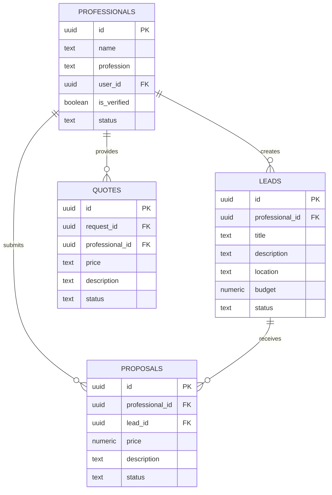

# Pro-Ofair App - Architecture Audit Summary

## Audit Overview

**Date**: July 15, 2025  
**Scope**: Full codebase and infrastructure analysis  
**Methodology**: Comprehensive code review, database analysis, and production readiness assessment  
**Tools Used**: Supabase MCP, Static Code Analysis, Database Schema Review

## Executive Summary

Pro-Ofair is a well-architected professional services marketplace platform with solid foundations in modern web technologies. The application demonstrates good architectural decisions with comprehensive security measures through RLS policies and a robust dual authentication system. However, several areas require attention to achieve production readiness.

## Key Findings

### 🎯 Strengths

1. **Modern Architecture**: React 18 + TypeScript + Vite provides excellent developer experience
2. **Comprehensive Security**: Row Level Security policies protect all data access
3. **Scalable Backend**: Supabase provides auto-scaling serverless functions
4. **Mobile-First Design**: Capacitor enables native mobile deployment
5. **Type Safety**: Full TypeScript coverage ensures code reliability
6. **Testing Framework**: Jest + Playwright provides comprehensive testing

### ⚠️ Areas of Concern

1. **Authentication Security**: Tokens stored in plaintext, no rate limiting
2. **Performance Issues**: Large bundle sizes, complex RLS policies
3. **Observability Gaps**: Limited monitoring and centralized logging
4. **Deployment Maturity**: No automated rollback or blue-green deployment
5. **Compliance**: GDPR compliance and data retention policies missing

## Architecture Analysis

### Frontend Architecture Score: 8/10

**Strengths:**
- Modern React patterns with hooks and context
- Excellent component organization and reusability
- Comprehensive UI component library (shadcn/ui)
- Efficient state management with React Query
- Mobile-responsive design with Tailwind CSS

**Areas for Improvement:**
- Bundle size optimization needed
- Memory leak prevention in components
- Enhanced error boundary implementation
- Performance monitoring integration

### Backend Architecture Score: 7/10

**Strengths:**
- Comprehensive database schema with proper relationships
- Robust RLS policies for data security
- Serverless Edge Functions for API endpoints
- Dual authentication system (OAuth + OTP)
- Real-time capabilities with Supabase subscriptions

**Areas for Improvement:**
- Token security needs enhancement
- Rate limiting implementation required
- Database query optimization needed
- Audit logging system missing

### Security Assessment: 6/10

**Current Security Measures:**
- Row Level Security on all tables
- Input validation with Zod schemas
- CORS configuration
- HTTPS enforcement
- SQL injection prevention

**Critical Security Gaps:**
- Authentication tokens stored in plaintext
- No rate limiting on authentication endpoints
- Limited brute force protection
- Missing comprehensive audit trails
- No security headers implementation

## Database Schema Assessment

### Schema Quality: 8/10

The database schema demonstrates solid design principles:



**Strengths:**
- UUID primary keys for security and scalability
- Proper foreign key relationships
- Comprehensive timestamp tracking
- Flexible media storage with arrays
- Geographic support with lat/lng fields

**Recommendations:**
- Add check constraints for data validation
- Implement enum types for status fields
- Add composite indexes for performance
- Consider partitioning for large tables

## User Experience Analysis

### User Flow Quality: 7/10

The application provides comprehensive user flows for all major features:

1. **Authentication Flow**: Smooth OTP-based registration and login
2. **Lead Management**: Intuitive lead creation and proposal submission
3. **Work Completion**: Streamlined work completion with payment processing
4. **Notification System**: Real-time updates and notifications

**UX Strengths:**
- Mobile-first responsive design
- Consistent navigation patterns
- Clear error messaging
- Loading states and feedback

**UX Improvements Needed:**
- Reduce OTP dependency friction
- Optimize image upload experience
- Enhance search and filter capabilities
- Improve form validation feedback

## Performance Analysis

### Current Performance: 6/10

**Frontend Performance:**
- Bundle size: 1.9MB (exceeds recommended 500KB)
- React Query provides efficient caching
- Lazy loading implemented for images
- Code splitting at route level

**Backend Performance:**
- Database queries generally well-optimized
- Complex RLS policies may impact performance
- Edge Functions have cold start latency
- Missing composite indexes for some queries

**Optimization Recommendations:**
1. Implement tree shaking and bundle optimization
2. Add composite database indexes
3. Optimize RLS policies for performance
4. Implement application-level caching

## Production Readiness Assessment

### Overall Production Readiness: 6/10

| Category | Score | Status |
|----------|-------|--------|
| Security | 6/10 | ⚠️ Needs Improvement |
| Performance | 6/10 | ⚠️ Needs Improvement |
| Observability | 5/10 | ⚠️ Needs Improvement |
| Deployment | 6/10 | ⚠️ Needs Improvement |
| Scalability | 7/10 | ⚠️ Minor Issues |
| Backup/Recovery | 6/10 | ⚠️ Needs Improvement |
| Compliance | 5/10 | ⚠️ Needs Improvement |

### Critical Production Blockers

1. **Authentication Security**: Plaintext token storage is a critical security risk
2. **Rate Limiting**: Missing rate limiting allows potential abuse
3. **Monitoring**: No centralized monitoring for production issues
4. **Compliance**: GDPR compliance gaps for European users
5. **Rollback Strategy**: No automated rollback mechanism

## Recommendations

### Phase 1: Critical Security (Immediate - Week 1-2)

**Priority 1: Authentication Security**
```typescript
// Current (Insecure)
const token = generateToken();
await supabase.from('auth_tokens').insert({ token, professional_id });

// Recommended (Secure)
const token = generateToken();
const hashedToken = await bcrypt.hash(token, 10);
await supabase.from('auth_tokens').insert({ 
  token: hashedToken, 
  professional_id 
});
```

**Priority 2: Rate Limiting**
```typescript
// Implement rate limiting on auth endpoints
const rateLimit = new RateLimit({
  windowMs: 15 * 60 * 1000, // 15 minutes
  max: 5, // limit each IP to 5 requests per windowMs
  message: 'Too many authentication attempts'
});
```

### Phase 2: Performance Optimization (Week 3-4)

**Bundle Optimization:**
- Remove unused dependencies
- Implement proper code splitting
- Add compression and minification
- Optimize image assets

**Database Optimization:**
```sql
-- Add composite indexes for common queries
CREATE INDEX idx_proposals_professional_status 
ON proposals(professional_id, status);

CREATE INDEX idx_quotes_professional_request 
ON quotes(professional_id, request_id);
```

### Phase 3: Observability (Week 5-6)

**Monitoring Implementation:**
- Centralized logging with structured logs
- Error tracking and alerting
- Performance metrics collection
- Health checks for all services

### Phase 4: Deployment & Recovery (Week 7-8)

**CI/CD Pipeline:**
```yaml
# Example GitHub Actions workflow
name: Deploy to Production
on:
  push:
    branches: [main]
jobs:
  deploy:
    runs-on: ubuntu-latest
    steps:
      - uses: actions/checkout@v2
      - name: Run tests
        run: npm test
      - name: Deploy to staging
        run: npm run deploy:staging
      - name: Run E2E tests
        run: npm run test:e2e
      - name: Deploy to production
        run: npm run deploy:production
```

## Technical Debt Analysis

### High Priority Technical Debt

1. **Authentication System**: Refactor to use secure token storage
2. **Bundle Size**: Optimize and split bundles for better performance
3. **RLS Policies**: Simplify complex policies for better performance
4. **Error Handling**: Implement comprehensive error boundary system
5. **Testing Coverage**: Increase test coverage to >80%

### Medium Priority Technical Debt

1. **Database Schema**: Add proper constraints and validations
2. **API Documentation**: Create comprehensive API documentation
3. **Component Library**: Standardize component interfaces
4. **Mobile Optimization**: Enhance mobile-specific features
5. **Accessibility**: Improve accessibility compliance

### Low Priority Technical Debt

1. **Code Comments**: Add comprehensive code documentation
2. **Refactoring**: Reduce code duplication
3. **Performance**: Micro-optimizations for better performance
4. **UI/UX**: Minor interface improvements
5. **Internationalization**: Add multi-language support

## Risk Assessment

### High Risk Areas

1. **Security Vulnerabilities**: Authentication token security
2. **Data Loss**: Insufficient backup testing
3. **Performance Issues**: Database query performance
4. **Compliance Violations**: GDPR non-compliance
5. **Scalability Limits**: Database connection limits

### Risk Mitigation Strategies

1. **Security**: Implement comprehensive security audit
2. **Data Protection**: Regular backup testing and validation
3. **Performance**: Implement performance monitoring
4. **Compliance**: Legal review and compliance implementation
5. **Scalability**: Load testing and capacity planning

## Success Metrics

### Key Performance Indicators

**Security Metrics:**
- Zero critical vulnerabilities
- 100% authentication success rate
- < 1% failed login attempts

**Performance Metrics:**
- < 2 second page load times
- < 500ms API response times
- > 95% uptime

**User Experience Metrics:**
- > 4.5 user satisfaction rating
- < 2% bounce rate
- > 80% feature adoption

## Conclusion

Pro-Ofair demonstrates a solid architectural foundation with modern technologies and good security practices. The application is functionally complete and provides a good user experience. However, several critical areas require attention before production deployment:

1. **Security hardening** is essential, particularly authentication token security
2. **Performance optimization** will improve user experience and reduce costs
3. **Observability implementation** is crucial for production monitoring
4. **Deployment automation** will reduce deployment risks
5. **Compliance work** is necessary for legal compliance

With focused effort on these areas, Pro-Ofair can achieve production readiness and provide a secure, scalable platform for professional services marketplace.

**Recommended Timeline: 8-10 weeks** for full production readiness implementation.

**Next Steps:**
1. Prioritize security fixes (Week 1-2)
2. Implement performance optimizations (Week 3-4)
3. Add monitoring and observability (Week 5-6)
4. Enhance deployment pipeline (Week 7-8)
5. Complete compliance work (Week 9-10)

This comprehensive audit provides a clear roadmap for achieving production readiness while maintaining the application's current functionality and user experience.