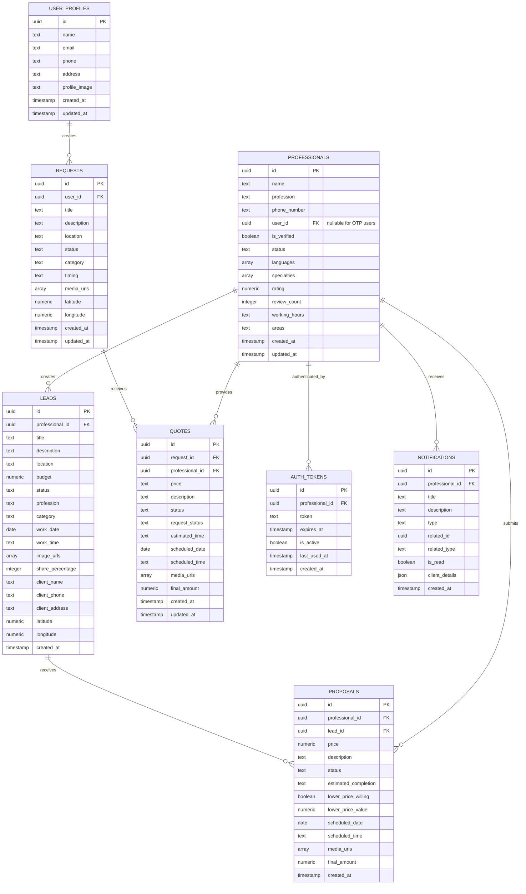
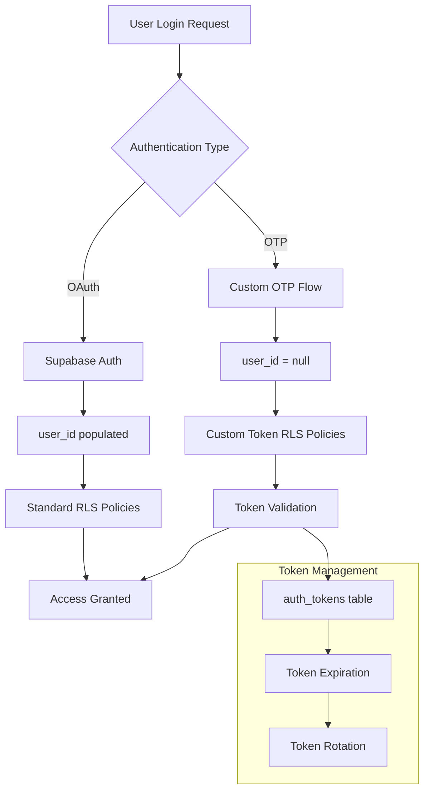
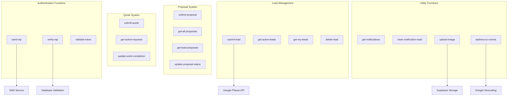

# Backend Audit Report

## Executive Summary

The Pro-Ofair backend is built on Supabase with a hybrid authentication system, comprehensive RLS policies, and serverless Edge Functions. The architecture follows modern best practices with strong security measures and scalable design patterns.

## Database Schema Analysis

### Core Tables Overview



### Database Schema Strengths

#### ✅ Strong Points
- **UUID Primary Keys**: All tables use UUID primary keys for security and scalability
- **Proper Indexing**: Good use of foreign key constraints and indexes
- **Timestamp Tracking**: Comprehensive created_at/updated_at tracking
- **Flexible Media Storage**: Array fields for multiple media URLs
- **Geographic Support**: Latitude/longitude fields for location-based features
- **Extensible Design**: JSON fields for flexible data structures

#### ⚠️ Areas for Improvement
- **Data Type Consistency**: Some fields use TEXT where ENUM would be more appropriate
- **Missing Constraints**: Some optional fields could benefit from check constraints
- **Audit Trails**: Limited audit logging for sensitive operations
- **Data Validation**: Database-level validation could be stronger

## Authentication System Audit

### Dual Authentication Architecture



### Authentication Security Assessment

#### ✅ Strengths
- **Multi-Factor Authentication**: SMS OTP implementation
- **Token Expiration**: Proper token lifecycle management
- **Session Management**: Secure session handling
- **Device Independence**: Works across mobile and web platforms

#### ⚠️ Security Concerns
- **Token Storage**: Tokens stored in plaintext in database
- **Rate Limiting**: No apparent rate limiting on OTP requests
- **Brute Force Protection**: Limited protection against brute force attacks
- **Session Fixation**: Potential session fixation vulnerabilities

#### 🔧 Recommendations
1. **Hash Tokens**: Store hashed tokens in database, not plaintext
2. **Implement Rate Limiting**: Add rate limiting to OTP endpoints
3. **Add Brute Force Protection**: Implement account lockout mechanisms
4. **Token Rotation**: Implement automatic token rotation
5. **Audit Logging**: Add comprehensive authentication audit logs

## Row Level Security (RLS) Analysis

### RLS Policy Assessment

#### Professional Data Access Policies
```sql
-- Example: Mixed authentication support
CREATE POLICY "Professionals can view their own quotes" ON quotes FOR SELECT USING (
  (professional_id IN (
    SELECT professionals.id FROM professionals
    WHERE (professionals.user_id = auth.uid())
  )) OR (professional_id IN (
    SELECT auth_tokens.professional_id FROM auth_tokens
    WHERE (auth_tokens.token = TRIM(BOTH ' ' FROM replace(
      COALESCE(
        current_setting('request.headers.authorization', true),
        current_setting('request.header.authorization', true),
        ''
      ), 'Bearer ', ''
    )))
    AND (auth_tokens.expires_at > now())
    AND (auth_tokens.is_active = true)
  ))
);
```

#### ✅ RLS Strengths
- **Comprehensive Coverage**: All tables have appropriate RLS policies
- **Multi-Auth Support**: Policies support both Supabase Auth and custom OTP
- **Granular Permissions**: Fine-grained access control
- **Admin Separation**: Clear admin vs user permission separation

#### ⚠️ RLS Concerns
- **Complex Policies**: Some policies are overly complex and hard to audit
- **Performance Impact**: Complex policies may impact query performance
- **Redundant Policies**: Multiple similar policies on same tables
- **Header Dependency**: Policies rely on HTTP headers which may be unreliable

## Edge Functions Architecture

### Function Organization



### Edge Function Security Analysis

#### ✅ Strengths
- **Input Validation**: Comprehensive input validation using Zod schemas
- **CORS Configuration**: Proper CORS headers for security
- **Error Handling**: Structured error responses
- **Authentication Checks**: Proper authentication validation

#### ⚠️ Security Concerns
- **JWT Verification**: Some functions have JWT verification disabled
- **Service Role Access**: Functions use service role keys with elevated permissions
- **Error Information**: Error messages may leak sensitive information
- **Rate Limiting**: No apparent rate limiting on function calls

#### 🔧 Recommendations
1. **Enable JWT Verification**: Where possible, enable JWT verification
2. **Implement Function-Level Rate Limiting**: Add rate limiting to prevent abuse
3. **Sanitize Error Messages**: Ensure error messages don't leak sensitive data
4. **Add Request Logging**: Implement comprehensive request logging
5. **Input Sanitization**: Add additional input sanitization layers

## Performance Analysis

### Database Performance

#### Query Performance Considerations
```sql
-- Example: Potentially expensive query
SELECT * FROM proposals 
WHERE professional_id = $1 
AND status IN ('pending', 'approved')
ORDER BY created_at DESC;
```

#### ✅ Performance Strengths
- **Proper Indexing**: Good use of foreign key indexes
- **UUID Performance**: UUIDs provide good distribution
- **Limited Result Sets**: Most queries limit results appropriately

#### ⚠️ Performance Concerns
- **Complex RLS Policies**: May slow down queries significantly
- **Missing Indexes**: Some composite indexes may be missing
- **N+1 Query Patterns**: Potential N+1 queries in some Edge Functions
- **Unoptimized Aggregations**: Some aggregation queries could be optimized

### Edge Function Performance

#### ✅ Strengths
- **Serverless Scaling**: Functions auto-scale with demand
- **Efficient Runtime**: Deno runtime is fast and secure
- **Connection Pooling**: Proper database connection management

#### ⚠️ Concerns
- **Cold Start Latency**: Functions may experience cold start delays
- **Memory Usage**: Some functions may use excessive memory
- **Concurrent Execution**: No apparent concurrency limits

## Data Migration Strategy

### Migration History Analysis
- **Total Migrations**: 47 migration files
- **Migration Naming**: Inconsistent naming convention
- **Migration Safety**: Most migrations appear to be safe
- **Rollback Strategy**: Limited rollback capabilities

### Migration Assessment

#### ✅ Strengths
- **Incremental Changes**: Migrations are appropriately sized
- **Data Preservation**: Migrations preserve existing data
- **Schema Evolution**: Good schema evolution practices

#### ⚠️ Concerns
- **No Rollback Scripts**: Missing rollback migrations
- **Manual Migrations**: Some migrations require manual intervention
- **Testing**: Limited migration testing in staging

## Backup and Recovery

### Current Backup Strategy
- **Automated Backups**: Supabase provides automated backups
- **Point-in-Time Recovery**: Available through Supabase
- **Cross-Region Replication**: Not currently implemented

#### 🔧 Recommendations
1. **Implement Regular Backup Testing**: Test backup restoration regularly
2. **Cross-Region Replication**: Consider implementing for high availability
3. **Backup Monitoring**: Add monitoring for backup success/failure
4. **Disaster Recovery Plan**: Develop comprehensive disaster recovery procedures

## Security Recommendations

### High Priority
1. **Hash Authentication Tokens**: Store hashed tokens instead of plaintext
2. **Implement Rate Limiting**: Add rate limiting to all public endpoints
3. **Enable JWT Verification**: Where disabled, re-enable with proper configuration
4. **Add Input Sanitization**: Comprehensive input sanitization

### Medium Priority
1. **Simplify RLS Policies**: Refactor complex policies for better performance
2. **Add Audit Logging**: Implement comprehensive audit trails
3. **Improve Error Handling**: Sanitize error messages to prevent information leakage
4. **Add Monitoring**: Implement comprehensive monitoring and alerting

### Low Priority
1. **Optimize Database Queries**: Add composite indexes where needed
2. **Implement Caching**: Add caching layers for frequently accessed data
3. **Add Documentation**: Improve API documentation and schema documentation

## Compliance Considerations

### Data Protection
- **GDPR Compliance**: Data retention and deletion policies needed
- **Privacy Controls**: User consent management required
- **Data Minimization**: Review data collection practices

### Security Standards
- **OWASP Top 10**: Address common security vulnerabilities
- **Data Encryption**: Ensure all data is encrypted at rest and in transit
- **Access Controls**: Implement principle of least privilege

## Conclusion

The Pro-Ofair backend demonstrates solid architectural decisions with comprehensive security measures. The dual authentication system and RLS policies provide strong data protection. However, there are opportunities for improvement in authentication security, performance optimization, and operational monitoring.

**Overall Security Score: 7/10**
**Performance Score: 6/10**
**Maintainability Score: 8/10**
**Scalability Score: 7/10**