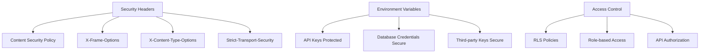
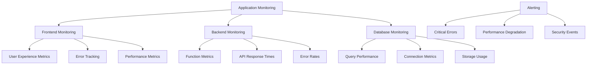
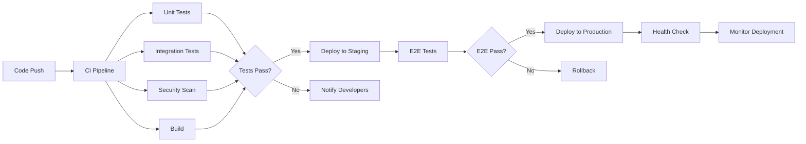

# Production Readiness Checklist

## Executive Summary

This document provides a comprehensive production readiness assessment for the Pro-Ofair application, covering security, performance, observability, and deployment considerations.

## 1. Security Assessment

### Authentication & Authorization

#### ✅ Implemented
- [x] **Dual Authentication System**: Supports both Supabase Auth and custom OTP
- [x] **Row Level Security**: Comprehensive RLS policies on all tables
- [x] **Token Management**: Custom token system with expiration
- [x] **Session Management**: Secure session handling with localStorage
- [x] **Professional Verification**: Multi-step verification process

#### ⚠️ Needs Attention
- [ ] **Token Hashing**: Tokens stored in plaintext in database
- [ ] **Rate Limiting**: No rate limiting on OTP endpoints
- [ ] **Brute Force Protection**: Limited protection against brute force attacks
- [ ] **Account Lockout**: No account lockout mechanism
- [ ] **Session Fixation**: Potential session fixation vulnerabilities

#### 🔧 Action Items
1. **Hash authentication tokens** before storing in database
2. **Implement rate limiting** on authentication endpoints
3. **Add brute force protection** with progressive delays
4. **Implement account lockout** after failed attempts
5. **Add session rotation** on login

### Data Protection

#### ✅ Implemented
- [x] **Input Validation**: Comprehensive validation using Zod schemas
- [x] **SQL Injection Prevention**: Parameterized queries throughout
- [x] **XSS Protection**: Content sanitization implemented
- [x] **CORS Configuration**: Proper CORS settings
- [x] **HTTPS Enforcement**: All communications over HTTPS

#### ⚠️ Needs Attention
- [ ] **Data Encryption**: Database encryption at rest verification needed
- [ ] **PII Protection**: Enhanced protection for personal information
- [ ] **Data Retention**: GDPR compliance for data retention
- [ ] **Audit Logging**: Comprehensive audit trail missing

### Security Headers & Configuration



#### 🔧 Recommendations
1. **Implement CSP**: Add Content Security Policy headers
2. **Add Security Headers**: Implement all recommended security headers
3. **Environment Variable Audit**: Review all environment variables
4. **Secret Management**: Implement proper secret rotation
5. **Vulnerability Scanning**: Regular security scans

## 2. Performance Analysis

### Frontend Performance

#### ✅ Strengths
- [x] **Modern Build Tools**: Vite for fast builds and HMR
- [x] **Code Splitting**: Route-based code splitting implemented
- [x] **Image Optimization**: Lazy loading and responsive images
- [x] **React Query**: Efficient data fetching and caching
- [x] **Bundle Analysis**: Regular bundle size monitoring

#### ⚠️ Performance Concerns
- [ ] **Large Bundle Size**: Main bundle exceeds 500KB
- [ ] **Unused Dependencies**: Potential unused libraries
- [ ] **Memory Leaks**: React component cleanup needed
- [ ] **Render Optimization**: Unnecessary re-renders

### Backend Performance

#### Database Performance Analysis
```sql
-- Example: Potentially slow query
SELECT p.*, l.title, l.description 
FROM proposals p 
JOIN leads l ON p.lead_id = l.id 
WHERE p.professional_id = $1 
AND p.status IN ('pending', 'accepted')
ORDER BY p.created_at DESC
LIMIT 20;
```

#### ✅ Strengths
- [x] **Database Indexing**: Proper foreign key indexes
- [x] **Connection Pooling**: Efficient connection management
- [x] **Serverless Scaling**: Edge Functions auto-scale
- [x] **Result Limiting**: Queries properly limit results

#### ⚠️ Performance Issues
- [ ] **Complex RLS Policies**: May impact query performance
- [ ] **Missing Composite Indexes**: Some queries need optimization
- [ ] **N+1 Query Patterns**: Potential N+1 issues in Edge Functions
- [ ] **Cold Start Latency**: Function cold starts

### Performance Monitoring

#### 📊 Metrics to Track
1. **Frontend Metrics**
   - First Contentful Paint (FCP)
   - Largest Contentful Paint (LCP)
   - Cumulative Layout Shift (CLS)
   - First Input Delay (FID)

2. **Backend Metrics**
   - Database query response times
   - Edge Function execution times
   - API endpoint response times
   - Error rates

3. **Mobile Metrics**
   - App startup time
   - Screen transition speed
   - Memory usage
   - Battery consumption

#### 🔧 Performance Optimization Plan
1. **Bundle Optimization**
   - Implement tree shaking
   - Remove unused dependencies
   - Optimize image assets
   - Add compression

2. **Database Optimization**
   - Add composite indexes
   - Optimize RLS policies
   - Implement query caching
   - Add connection pooling

3. **Mobile Optimization**
   - Optimize for mobile networks
   - Implement offline caching
   - Reduce memory usage
   - Optimize animations

## 3. Observability & Monitoring

### Logging Implementation

#### ✅ Current Logging
- [x] **Frontend Logging**: Console logging for debugging
- [x] **Edge Function Logging**: Structured logging in functions
- [x] **Error Tracking**: Basic error handling
- [x] **Debug Information**: Comprehensive debug logs

#### ⚠️ Logging Gaps
- [ ] **Centralized Logging**: No centralized log aggregation
- [ ] **Log Correlation**: No request correlation IDs
- [ ] **Audit Trail**: Missing audit logs for sensitive operations
- [ ] **Performance Logging**: No performance metrics logging

### Monitoring Strategy



#### 🔧 Monitoring Implementation Plan
1. **Frontend Monitoring**
   - Implement Web Vitals tracking
   - Add error boundary logging
   - Track user interactions
   - Monitor bundle performance

2. **Backend Monitoring**
   - Add function execution monitoring
   - Track database performance
   - Monitor API endpoints
   - Implement health checks

3. **Alerting System**
   - Set up critical error alerts
   - Monitor performance thresholds
   - Track security events
   - Implement escalation procedures

### Error Handling & Reporting

#### ✅ Current Error Handling
- [x] **Try-Catch Blocks**: Comprehensive error catching
- [x] **User-Friendly Messages**: Clear error messages
- [x] **Fallback States**: Graceful degradation
- [x] **Retry Logic**: Automatic retry for transient errors

#### ⚠️ Error Handling Gaps
- [ ] **Error Aggregation**: No centralized error tracking
- [ ] **Error Classification**: No error severity classification
- [ ] **Error Recovery**: Limited automatic recovery
- [ ] **Error Analytics**: No error trend analysis

## 4. Deployment & CI/CD

### Current Deployment Setup

#### ✅ Deployment Strengths
- [x] **Git Integration**: Version control integration
- [x] **Environment Separation**: Clear dev/staging/prod separation
- [x] **Automated Builds**: Build process automation
- [x] **Mobile Deployment**: Capacitor builds for mobile platforms

#### ⚠️ Deployment Concerns
- [ ] **Rollback Strategy**: No automated rollback mechanism
- [ ] **Blue-Green Deployment**: No zero-downtime deployment
- [ ] **Database Migrations**: Manual migration process
- [ ] **Canary Deployments**: No gradual rollout capability

### CI/CD Pipeline Design



#### 🔧 CI/CD Improvements
1. **Automated Testing**
   - Expand test coverage
   - Add integration tests
   - Implement E2E testing
   - Add performance testing

2. **Deployment Automation**
   - Implement blue-green deployment
   - Add automated rollback
   - Implement canary deployments
   - Add deployment monitoring

3. **Security Integration**
   - Add security scanning
   - Implement dependency checking
   - Add compliance verification
   - Monitor security events

## 5. Scalability Assessment

### Database Scalability

#### Current Database Design
- **PostgreSQL**: Robust relational database
- **UUID Primary Keys**: Good for horizontal scaling
- **Proper Indexing**: Optimized for current load
- **Connection Pooling**: Efficient connection management

#### 📈 Scalability Considerations
1. **Read Replicas**: Implement read replicas for scaling reads
2. **Partitioning**: Consider table partitioning for large tables
3. **Caching**: Implement Redis caching layer
4. **Archive Strategy**: Implement data archiving for old records

### Application Scalability

#### Current Architecture
- **Serverless Functions**: Auto-scaling Edge Functions
- **CDN Integration**: Static asset delivery
- **Mobile-First Design**: Optimized for mobile devices
- **React Architecture**: Component-based scalability

#### 🔧 Scalability Improvements
1. **Caching Strategy**
   - Implement application-level caching
   - Add CDN for dynamic content
   - Use browser caching effectively
   - Implement service worker caching

2. **Performance Optimization**
   - Implement lazy loading
   - Add virtual scrolling
   - Optimize image delivery
   - Implement code splitting

## 6. Backup & Recovery

### Current Backup Strategy

#### ✅ Backup Strengths
- [x] **Automated Backups**: Supabase automated backups
- [x] **Point-in-Time Recovery**: Available through Supabase
- [x] **Data Replication**: Built-in replication
- [x] **Version Control**: Code versioning with Git

#### ⚠️ Backup Gaps
- [ ] **Backup Testing**: No regular backup restoration testing
- [ ] **Cross-Region Backup**: Limited geographic redundancy
- [ ] **Backup Monitoring**: No backup success/failure monitoring
- [ ] **Disaster Recovery Plan**: No comprehensive DR plan

### Recovery Procedures

#### 🔧 Recovery Improvements
1. **Backup Testing**
   - Regular backup restoration tests
   - Automated backup verification
   - Recovery time measurement
   - Data integrity validation

2. **Disaster Recovery**
   - Develop comprehensive DR plan
   - Implement cross-region backups
   - Test disaster recovery procedures
   - Document recovery processes

## 7. Compliance & Legal

### Data Protection Compliance

#### ✅ Current Compliance
- [x] **Data Encryption**: Data encrypted in transit
- [x] **Access Controls**: Proper access restrictions
- [x] **User Consent**: Basic consent management
- [x] **Privacy Features**: User privacy controls

#### ⚠️ Compliance Gaps
- [ ] **GDPR Compliance**: Full GDPR compliance needed
- [ ] **Data Retention**: Data retention policies
- [ ] **Right to Deletion**: User data deletion capabilities
- [ ] **Privacy Policy**: Comprehensive privacy policy

### Security Compliance

#### 🔧 Compliance Requirements
1. **GDPR Compliance**
   - Implement data subject rights
   - Add consent management
   - Implement data portability
   - Add breach notification

2. **Security Standards**
   - Implement OWASP guidelines
   - Add security certifications
   - Regular security audits
   - Vulnerability assessments

## 8. Production Readiness Score

### Overall Assessment

| Category | Score | Status |
|----------|-------|--------|
| Security | 7/10 | ⚠️ Needs Improvement |
| Performance | 6/10 | ⚠️ Needs Improvement |
| Observability | 5/10 | ⚠️ Needs Improvement |
| Deployment | 6/10 | ⚠️ Needs Improvement |
| Scalability | 7/10 | ⚠️ Needs Improvement |
| Backup/Recovery | 6/10 | ⚠️ Needs Improvement |
| Compliance | 5/10 | ⚠️ Needs Improvement |

### **Overall Production Readiness: 6/10**

## 9. Priority Action Plan

### Phase 1: Critical Security (Week 1-2)
1. **Hash authentication tokens** in database
2. **Implement rate limiting** on authentication endpoints
3. **Add brute force protection** mechanisms
4. **Implement account lockout** functionality
5. **Add security headers** to all responses

### Phase 2: Performance Optimization (Week 3-4)
1. **Optimize bundle size** and remove unused dependencies
2. **Add composite database indexes** for slow queries
3. **Implement application caching** layer
4. **Optimize RLS policies** for better performance
5. **Add performance monitoring** tools

### Phase 3: Observability (Week 5-6)
1. **Implement centralized logging** system
2. **Add error tracking** and monitoring
3. **Set up alerting** for critical issues
4. **Implement health checks** for all services
5. **Add performance metrics** tracking

### Phase 4: Deployment & Recovery (Week 7-8)
1. **Implement automated rollback** mechanisms
2. **Add blue-green deployment** capability
3. **Implement backup testing** procedures
4. **Create disaster recovery** plan
5. **Add deployment monitoring** tools

### Phase 5: Compliance & Documentation (Week 9-10)
1. **Implement GDPR compliance** features
2. **Add data retention** policies
3. **Create security documentation** 
4. **Implement audit logging** system
5. **Add compliance monitoring** tools

## 10. Success Metrics

### Key Performance Indicators

#### Security Metrics
- Zero critical security vulnerabilities
- 100% authentication success rate
- < 1% failed login attempts
- Zero data breaches

#### Performance Metrics
- < 2 second page load times
- < 500ms API response times
- > 95% uptime
- < 5% error rate

#### User Experience Metrics
- > 4.5 user satisfaction rating
- < 2% bounce rate
- > 80% feature adoption
- < 5 second average task completion

This production readiness checklist provides a comprehensive roadmap for ensuring the Pro-Ofair application meets enterprise-grade production standards.