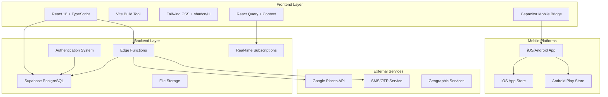
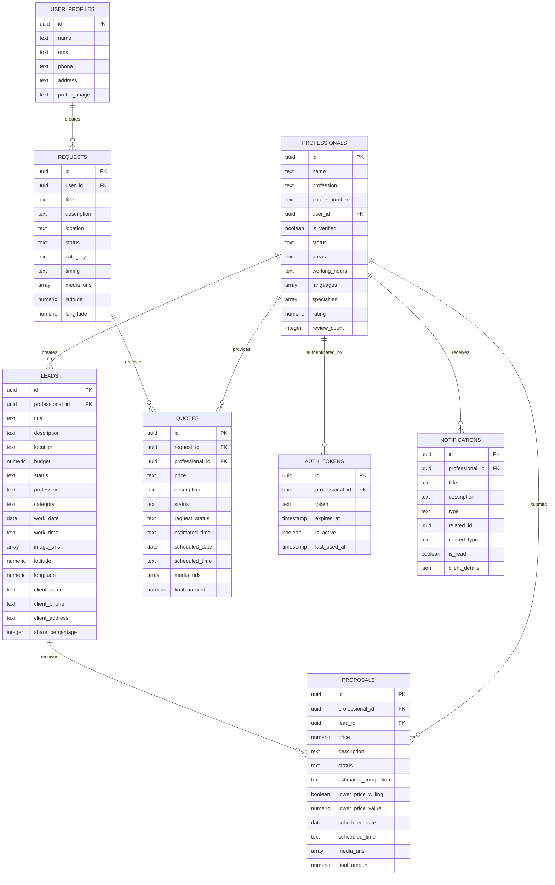
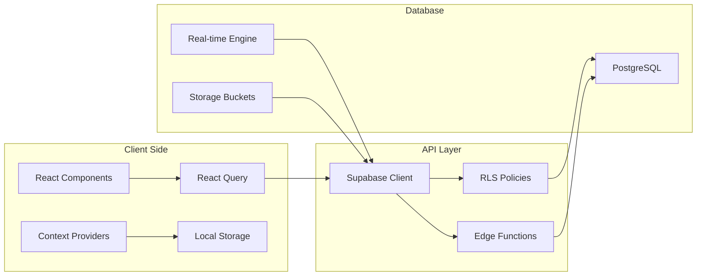

# Pro-Ofair App - System Overview

## Architecture Summary

**Pro-Ofair** is a professional services marketplace platform that connects skilled professionals with clients seeking services. The application is built as a hybrid mobile app using modern web technologies.

## High-Level Architecture

## Technology Stack

### Frontend
- **Framework**: React 18 with TypeScript
- **Build Tool**: Vite 5.4.1
- **State Management**: React Query v5 + React Context
- **UI Components**: shadcn/ui with Radix UI primitives
- **Styling**: Tailwind CSS 3.4.11
- **Routing**: React Router DOM 6.26.2
- **Mobile**: Capacitor for native mobile deployment

### Backend
- **Database**: Supabase PostgreSQL with real-time capabilities
- **API**: Edge Functions (Deno runtime)
- **Authentication**: Dual system (Supabase Auth + Custom OTP)
- **File Storage**: Supabase Storage
- **Real-time**: Supabase Realtime subscriptions

### Development & Testing
- **Testing**: Jest + React Testing Library + Playwright
- **TypeScript**: Full type safety
- **Linting**: ESLint with TypeScript rules
- **Package Manager**: npm

## Core Domain Model

## System Components

### Authentication System
- **Dual Authentication**: Supports both Supabase Auth (OAuth) and Custom OTP
- **OTP Flow**: SMS-based verification for professionals
- **Token Management**: Custom JWT-like tokens stored in `auth_tokens` table
- **Session Management**: localStorage + context for session persistence

### Core Business Logic
1. **Lead Management**: Professionals create leads, others submit proposals
2. **Request/Quote System**: Clients submit requests, professionals provide quotes
3. **Work Completion**: Tracking and payment processing for completed work
4. **Notifications**: Real-time updates for all stakeholders
5. **Rating System**: Professional ratings and reviews

### Data Flow Architecture

## Key Features

### For Professionals
- **Profile Management**: Complete professional profiles with certifications
- **Lead Creation**: Post job opportunities with revenue sharing
- **Proposal System**: Submit proposals for available leads
- **Quote Management**: Respond to client requests with quotes
- **Work Completion**: Track and complete jobs with payment processing
- **Notifications**: Real-time updates on lead activity
- **Performance Tracking**: Ratings, reviews, and earnings dashboard

### For Clients
- **Request Submission**: Post service requests with media attachments
- **Quote Comparison**: Receive and compare quotes from professionals
- **Professional Discovery**: Browse and contact professionals
- **Work Tracking**: Monitor job progress and completion

### Administrative Features
- **User Management**: Professional verification and status management
- **Content Moderation**: Review and approve submissions
- **Analytics**: System performance and usage metrics
- **Payment Processing**: Commission tracking and payment management

## Mobile-First Design

The application is built with a mobile-first approach:
- **Responsive Design**: Works seamlessly on mobile and desktop
- **Native Features**: Camera access, location services, push notifications
- **Offline Capabilities**: Local storage for critical data
- **Performance**: Optimized for mobile networks and devices

## Security Architecture

### Row Level Security (RLS)
- **Table-Level Security**: Every table has appropriate RLS policies
- **Multi-Auth Support**: Policies support both Supabase Auth and custom OTP
- **Granular Permissions**: Users can only access their own data
- **Admin Controls**: Separate admin authentication and permissions

### Data Protection
- **Input Validation**: Comprehensive validation using Zod schemas
- **SQL Injection Prevention**: All queries use parameterized statements
- **XSS Protection**: Content sanitization and CSP headers
- **CORS Configuration**: Proper CORS settings for API endpoints

## Performance Considerations

### Frontend Optimization
- **Code Splitting**: Dynamic imports for route-based splitting
- **Image Optimization**: Lazy loading and responsive images
- **Bundle Analysis**: Regular bundle size monitoring
- **React Query**: Efficient data fetching and caching

### Backend Performance
- **Database Indexing**: Proper indexes for common queries
- **Edge Functions**: Serverless scaling for API endpoints
- **Real-time Efficiency**: Optimized subscriptions and filters
- **CDN Integration**: Static asset delivery via CDN

## Deployment Architecture

### Frontend Deployment
- **Build Process**: Vite production builds with optimization
- **Environment Management**: Separate dev/staging/prod configurations
- **Asset Optimization**: Minification and compression
- **Mobile Builds**: Capacitor builds for iOS/Android

### Backend Infrastructure
- **Supabase Cloud**: Managed PostgreSQL and serverless functions
- **Edge Functions**: Auto-scaling Deno runtime
- **Database Backups**: Automated backup and recovery
- **Monitoring**: Built-in observability and alerting

## Development Workflow

### Code Organization
- **Modular Architecture**: Clear separation of concerns
- **Component Library**: Reusable UI components
- **Service Layer**: Abstracted API calls
- **Type Safety**: Comprehensive TypeScript coverage

### Quality Assurance
- **Testing Strategy**: Unit, integration, and E2E tests
- **Code Reviews**: Pull request workflow
- **Linting**: Automated code quality checks
- **Type Checking**: Continuous TypeScript validation

This system architecture provides a solid foundation for a scalable, maintainable, and secure professional services marketplace platform.