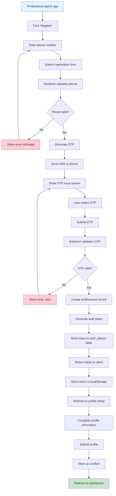
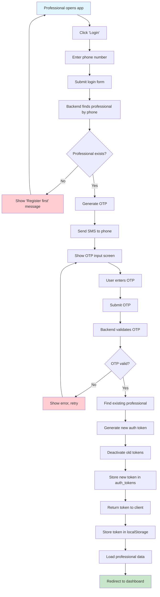
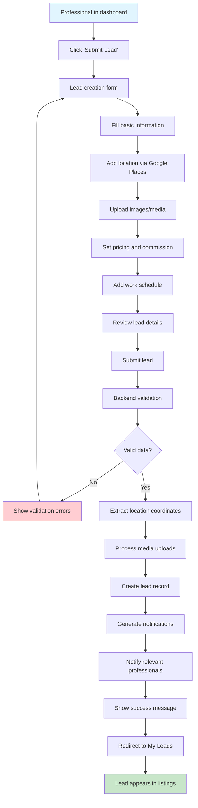
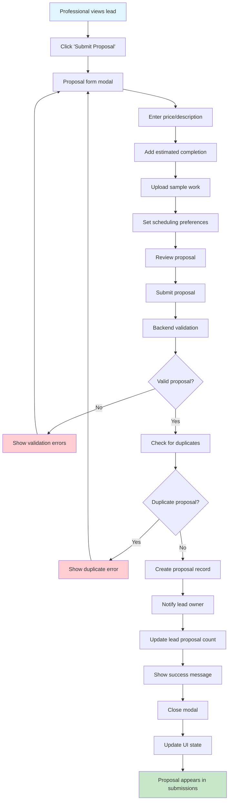
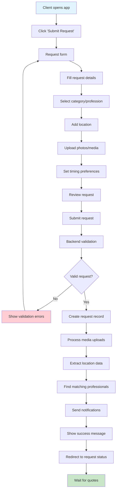
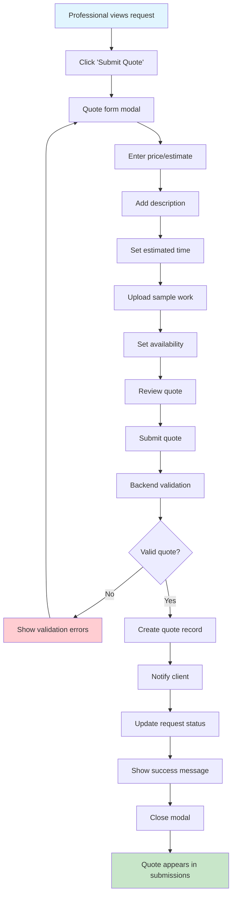
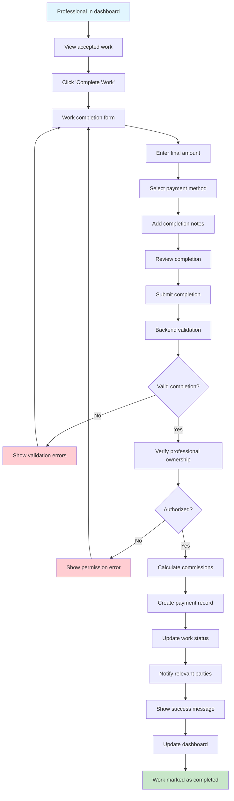
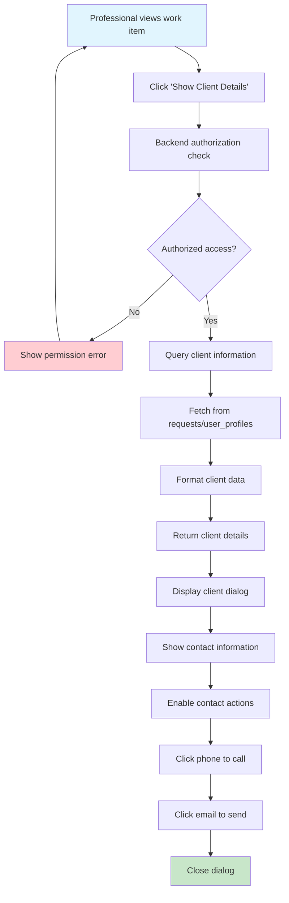
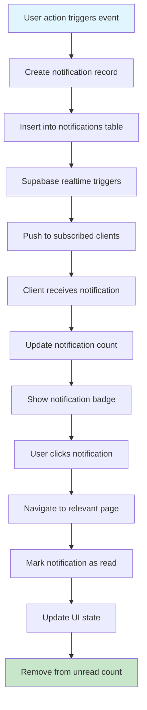

# User Flows Analysis

## Overview

This document provides a comprehensive analysis of all user flows in the Pro-Ofair application, including detailed step-by-step descriptions and Mermaid flowcharts for each main user journey.

## Core User Types

1. **Professionals**: Service providers who create leads and submit proposals
2. **Clients**: Service seekers who submit requests and accept quotes
3. **Administrators**: System managers who oversee the platform

## Authentication Flows

### 1. Professional OTP Registration Flow

**Step-by-Step Description:**
1. Professional opens the app and clicks "Register"
2. Enters phone number in registration form
3. System validates phone number format and uniqueness
4. If valid, generates 6-digit OTP code
5. Sends SMS with OTP to provided phone number
6. User enters OTP in verification screen
7. System validates OTP against stored value
8. If valid, creates professional record with user_id = null
9. Generates unique auth token and stores in auth_tokens table
10. Returns token to client for storage in localStorage
11. Redirects to profile setup screen
12. User completes profile information (name, profession, areas, etc.)
13. System marks professional as verified
14. Redirects to main dashboard

**Error Handling:**
- Invalid phone format: Shows validation error
- Phone already registered: Shows error message
- OTP expired: Allows resending OTP
- Invalid OTP: Shows error with retry option
- Network errors: Shows retry dialog

### 2. Professional Login Flow

## Lead Management Flows

### 3. Lead Creation Flow

**Step-by-Step Description:**
1. Professional navigates to lead creation from dashboard
2. Fills out lead form with title, description, category
3. Selects location using Google Places autocomplete
4. Uploads relevant images or media files
5. Sets budget range and commission percentage
6. Specifies work schedule and timeline
7. Reviews all entered information
8. Submits lead for processing
9. Backend validates all fields and media
10. Extracts geographic coordinates from location
11. Processes and stores media in Supabase Storage
12. Creates lead record in database
13. Generates notifications for matching professionals
14. Returns success confirmation to user
15. Redirects to "My Leads" page where lead appears

### 4. Proposal Submission Flow

## Request/Quote Management Flows

### 5. Client Request Submission Flow

### 6. Quote Submission Flow

## Work Completion Flows

### 7. Work Completion Flow

**Step-by-Step Description:**
1. Professional views dashboard with accepted work items
2. Clicks "Complete Work" button on a work item
3. Opens work completion form modal
4. Enters final payment amount
5. Selects payment method (cash, credit, bank transfer, etc.)
6. Adds optional completion notes
7. Reviews all completion details
8. Submits work completion
9. Backend validates all required fields
10. Verifies professional owns the work item
11. Calculates OFAIR commission and any revenue sharing
12. Creates payment record in appropriate table
13. Updates work status to 'completed'
14. Sends notifications to relevant parties
15. Returns success confirmation
16. Updates dashboard UI to reflect completion

### 8. Client Details Access Flow

## Notification System Flows

### 9. Real-time Notification Flow

## Error Handling Patterns

### Common Error Scenarios

1. **Network Connectivity Issues**
   - Show retry dialog with exponential backoff
   - Cache requests for offline handling
   - Provide clear error messages

2. **Authentication Failures**
   - Redirect to login screen
   - Clear stored tokens
   - Show appropriate error messages

3. **Validation Errors**
   - Highlight invalid fields
   - Show specific error messages
   - Allow easy correction

4. **Permission Errors**
   - Show clear permission denied messages
   - Suggest appropriate actions
   - Log security events

## UX Consistency Analysis

### Navigation Patterns
- **Bottom Navigation**: Consistent across all main sections
- **Back Button**: Always available in sub-pages
- **Modal Dialogs**: Consistent styling and behavior
- **Loading States**: Skeleton screens for better UX

### Form Patterns
- **Consistent Validation**: Real-time validation feedback
- **Error States**: Clear error messaging
- **Success States**: Confirmation messages and redirects
- **Loading States**: Disabled buttons during submission

### Data Display Patterns
- **Card Layouts**: Consistent card designs
- **Empty States**: Helpful empty state messages
- **Pagination**: Consistent pagination controls
- **Filtering**: Similar filter interfaces

## Potential Friction Points

### High Friction Areas
1. **OTP Verification**: SMS delays can frustrate users
2. **Image Upload**: Large images may upload slowly
3. **Location Selection**: Google Places API can be slow
4. **Form Validation**: Complex forms with many required fields

### Medium Friction Areas
1. **Navigation Depth**: Some features require multiple clicks
2. **Data Loading**: Initial data loading can be slow
3. **Search Functionality**: Limited search capabilities
4. **Filter Options**: Complex filtering may confuse users

### Recommendations for Improvement
1. **Reduce OTP Dependency**: Consider alternative authentication methods
2. **Optimize Image Handling**: Implement client-side compression
3. **Improve Loading States**: Add skeleton screens and progress indicators
4. **Simplify Forms**: Break complex forms into steps
5. **Add Search**: Implement comprehensive search functionality
6. **Enhance Filters**: Simplify filter interfaces

## Mobile-Specific Considerations

### Touch Interactions
- **Button Sizing**: Appropriately sized for touch
- **Gesture Support**: Swipe gestures where appropriate
- **Haptic Feedback**: Provide tactile feedback

### Performance Considerations
- **Lazy Loading**: Implement for images and lists
- **Data Caching**: Cache frequently accessed data
- **Bundle Optimization**: Minimize JavaScript bundle size

### Platform Integration
- **Camera Access**: Seamless photo capture
- **Location Services**: Accurate location detection
- **Push Notifications**: Timely notification delivery

## Accessibility Considerations

### Visual Accessibility
- **Color Contrast**: Ensure sufficient contrast ratios
- **Font Sizes**: Support system font size preferences
- **Focus States**: Clear focus indicators

### Interactive Accessibility
- **Keyboard Navigation**: Full keyboard support
- **Screen Reader Support**: Proper ARIA labels
- **Voice Control**: Support for voice commands

### Cognitive Accessibility
- **Clear Navigation**: Intuitive navigation patterns
- **Consistent Layouts**: Predictable interface patterns
- **Error Prevention**: Clear validation and error messages

This comprehensive user flow analysis provides a foundation for understanding user interactions and identifying opportunities for improvement in the Pro-Ofair application.